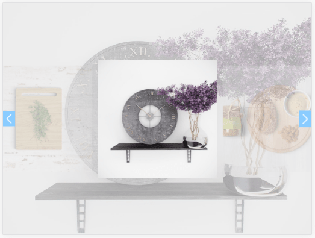

# Сarousel-kai
#### (Карусель картинок на jQuery)
***
### Вы можете скачать "Сarousel-kai" Zip архивом.
[](https://github.com/AndreiKaragayr/carousel-kai.git)
---


***
### Про библиотеку:
1. Сarousel-kai - это библиотера на jQuery в основе лежит библиотека от **owl.carousel**, также с использованием CSS-препроцессора  -  SCSS. Задача **carousel-kai** упростить работу с библиотекой **owl.carousel**.
2. Сarousel-kai преобразует картинки  в блоки и подготавливает их для owl.carousel,  дальше создает:
 - карусель Resize, она всегда на всю длины и высоту окна, а картинка подстраиваются
 - свой интерфейс (кнопки управления)
 - большой preview блок с картинкой которая сейчас просматривается
 - анимацию при перелистывании
  
#### В Сarousel-kai входит:
 - папка `css` - стили:
   + стили иконок `simple-line-icons.css`
   + стили owl `owl.carousel.min.css`
   + скомпилированные стили kai `carousel-kai.css`
 - папка `sass` - стили kai `carousel-kai.scss`
 - папка `js`:
   + библиотеки `jquery-3.2.1.min.js`
   + библиотеки `owl.carousel.min.js`
   + библиотеки `carousel-kai.js`
 - папка `fonts` - шрифты simple-line-icons
 - `demo.html` - презентационная версия библиотеки
 - `sampel.html` - простая структура
***

### Технические зависимости:
  + [jquery](https://jquery.com/)
  + [owl-carousel](https://owlcarousel2.github.io/OwlCarousel2/)
  + [scss](https://sass-scss.ru/guide/)
  + [simple-line-icons](http://simplelineicons.com/)
 > Все зависимости собраны и подключены в библиотеке, вы можете все подключения забрать в `demo.html`
 >> Для компиляции scss использовался `npm gulp`

### Шаги по установке:
1. Скачать [zip архив](https://github.com/AndreiKaragayr/carousel-kai.git) или клонировать  репозиторий себе на ПК
2. Скачиваем [jquery](https://jquery.com/) - без него магия не случится :)
3. Копируем все записимости себе в поект.
4. Для компиляции scss использовался `npm gulp` и Sublime Text 3 (Вы можете использовать свой)
5. В `index.html` подключаем стили:
   + стили иконок `<link rel="stylesheet" href="css/simple-line-icons.css">`
   + стили owl `<link rel="stylesheet" href="css/owl.carousel.min.css">`
   + стили kai `<link rel="stylesheet" href="css/carousel-kai.css">`
6. В `index.html` подключаем JavaScript:
   + библиотеки `<script src="js/jquery-3.2.1.min.js"></script>`
   + библиотеки `<script src="js/owl.carousel.min.js"></script>`
   + библиотеки `<script src="js/carousel-kai.js"></script>`
7. В `sample.html` можно посмотреть простую структуру html.

***
### Как с этим работать:

carousel-kai работает очень просто, нам понадобится родительский блок  классом `class="carousel-kai"` в нем создадим блок с классом `class="owl-carousel"`, чтоб подключить библиотеку owl, теперь мы вставляем свои картинки ``. Вот и все у нас получается структука:
```
<div class="carousel-kai">
	<div class="owl-carousel">
		
		
		
	</div>
</div>
```
Все остальное делает carousel-kai в связке с owl-carousel. Пьем чайчик радуемся жизни =).

***
Если что то не получилось посмотрите  `demo.html`

